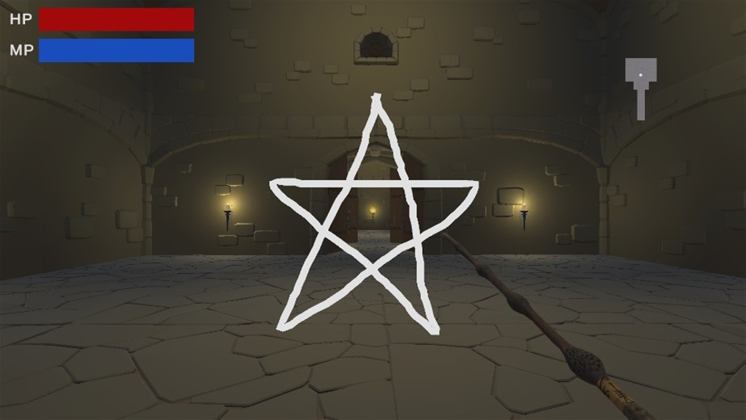
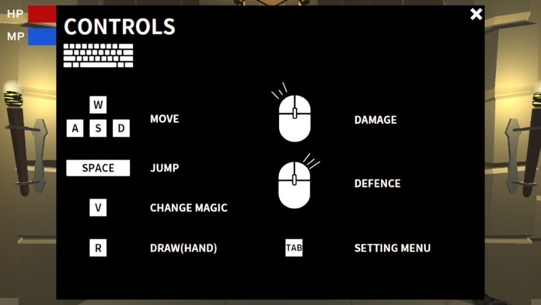

# 魔法地下城 — Magic

> 一款結合 **影像辨識** 和 **機器學習** 的 3D 地下城關卡遊戲，遊戲中擁有各種魔法屬性、敵人和機制。玩家可使用 **滑鼠** 或 **啟動相機** 手繪符號改變當前的魔法屬性。玩家藉由切換不同的元素魔法，運用屬性克制打敗怪物與 Boss。

## 專案簡介
Magic 的故事背景設定在神秘的魔法地下城，玩家自未知之處甦醒，必須一路突破重重房間、解開機關謎題，並擊敗潛伏的最終 Boss，才能成功逃離這座危險的迷宮。

遊戲支援 **滑鼠繪圖** 與 **手勢繪圖** 兩種操作模式; 右上角顯示小地圖，會隨著探索逐步揭露。

## 特色功能
- **六種魔法屬性**: 水、火、木、土、光、闇；具有 **屬性克制** 與 **防禦減傷** 機制  
- **雙操作模式**: 支援滑鼠繪圖或開啟相機以手勢繪圖  
- **地圖與機關**: 多房間設計、**傳送祭壇/補血祭壇**、**拉桿機制**、部分跑酷關卡  
- **教學關卡**: 6 個元素教學房間，熟悉操作後傳送至主地圖  
- **最終 Boss 戰**: 需先摧毀 Boss 召喚的水晶後，才能對 Boss 造成傷害  

遊戲中提供多項設定讓你微調體驗 (例如操作模式、靈敏度等)。

### 元素繪圖
玩家可選擇使用滑鼠在螢幕上繪製元素圖案，或透過相機的手勢追蹤來繪製。辨識成功後會即時切換魔法屬性。

**使用滑鼠繪製元素之圖案**

**開啟相機使用手繪製元素之圖案**

### 戰鬥畫面
戰鬥包含生命與魔力管理。魔力會隨時間回復，但在施放攻擊或防禦技能時會暫停回復。

**玩家攻擊特效 (水元素)**

**暗黑骷髏**

**重裝騎士**

若血量歸零，將回到該關卡重新挑戰。

### Boss 關卡
Boss 具備特殊機制與技能。需要先擊碎 Boss 生成的水晶，才可對 Boss 造成傷害，戰鬥中亦可能隨機生怪。

通關後會出現傳送門，可前往下一個區域。

## 使用技術
- **Unity + C#**: 主遊戲開發  
- **Mediapipe**: 手勢追蹤與辨識 (將手指座標轉換為世界座標以繪線)  
- **TensorFlow Lite**: 圖案辨識 (以 TensorFlow 訓練後轉為 TFLite)  

## 機器學習與資料集
- **資料集**: 391 張圖片；切分 **Train 70% / Val 20% / Test 10%**；輸入縮放至 **240×135** 以兼顧效能  
- **模型**: 以 **ResNet50** 為基底，加入 Dense 與 Dropout；**Adam(lr=0.001)**、**Batch size=16**、**Epoch=20**  
- **測試表現**: Test accuracy ≈ **93.75%**；混淆矩陣顯示多數類別可正確辨識，土元素較易誤判  
- **推論流程**: 擷取目前畫面 → 縮放至 240×135 → 取 RGB → 丟入 TFLite 模型推論  

> 類別共 7 種: 水、火、木、土、光、闇、其他

**部分原始圖片及其Label**

**Accuracy曲線**

**Confusion Matrix (Test Dataset)**

## 操作與 UI
- **左上角**: 血量與魔力值，魔力會隨時間回復，消耗時暫停回復  
- **右上角**: 小地圖，顯示已探索房間與房內物件  
- **元素切換**: 透過滑鼠或手勢繪圖 → 模型辨識 → 切換元素的攻擊或防禦  

## 關卡內容
- **教學區**: 6 間房間對應 6 種元素，包含近戰與遠程敵人  
- **主地圖**: 打倒房內所有敵人才能離開; 透過拉桿開啟最後區域; 地圖含部分跑酷設計  
- **Boss 機制**: 先打碎水晶才能造成傷害 Boss; 戰鬥中會隨機生怪，Boss 被擊倒後自動清場並開啟傳送祭壇  

**新手教學地圖 (俯視圖)**

**主地圖 (俯視圖)**

